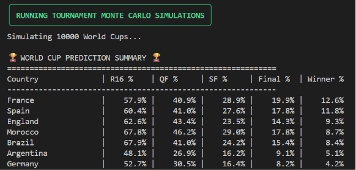

# World Cup Predictor & Monte Carlo Tournament Simulator

Predict international football match outcomes and simulate World Cup tournaments using a feature-engineered XGBoost pipeline.



## Overview

This repository builds datasets, trains a match outcome model, and runs tournament simulations from raw squad, league, and historical match data.

The workflow is driven by `run_pipeline.py`.

## Key features

- Raw data collection from international fixtures, tournaments, leagues, and squads
- Feature engineering for squad chemistry, match-up deltas, ELO, form, and experience
- XGBoost model training and evaluation for match outcome prediction
- Model comparison across saved artifacts
- World Cup group stage and full tournament Monte Carlo simulation

## Repository layout

```text
wm_predictor/
├── assets/                # static assets and diagrams
│   └── simulation.png
├── data/                  # raw and processed data files
├── models/                # trained model artifacts
├── notebooks/             # analysis and simulation notebooks
├── src/                   # pipeline modules and ML code
├── run_pipeline.py        # unified CLI orchestrator
└── requirements.txt       # Python dependencies
```

## Requirements

Install dependencies with:

```bash
python -m pip install -r requirements.txt
```

## CLI usage

Use the CLI help output for available options:

```bash
python run_pipeline.py -h
```

Commands:

- `python run_pipeline.py scrape [--step all|leagues|tournaments|ucl|squads|historical]`
- `python run_pipeline.py features [--step all|engineering|dataset]`
- `python run_pipeline.py train [--model-name <file>] [--tune]`
- `python run_pipeline.py info --model-name <file>`
- `python run_pipeline.py compare`
- `python run_pipeline.py simulate-groups --model-name <file>`
- `python run_pipeline.py simulate-tournament --model-name <file> --sims <count>`
- `python run_pipeline.py all [--model-name <file>] [--tune] [--sims <count>]`

## Data paths

- `data/processed/features/`
- `data/processed/model_input/`
- `data/processed/squads/`
- `models/`